# CDL ICML 2024 — Merged Primer (catgraph-dl)

> **Paper:** Gavranović\*, Lessard\*, Dudzik\*, von Glehn, Araújo, Veličković, *Categorical Deep Learning is an Algebraic Theory of All Architectures* ([arXiv:2402.15332v2](https://arxiv.org/abs/2402.15332), 6 Jun 2024; ICML 2024 PMLR 235:15209-15241).
>
> **Title parsing reminder:** read as "Categorical Deep Learning is an Algebraic {Theory of All Architectures}", *not* "Categorical Deep Learning is an {Algebraic Theory} of All Architectures".
>
> **Document provenance.** This file is a verbatim merger of two pre-existing companion artefacts produced during the catgraph-dl Phase DL-1 / DL-2 substrate work (March-May 2026):
> - **Part I** — `categorical_deep_learning_transcript_vs_paper.md` (transcript ↔ paper comparison; flags transcript-only material like the Hopf-fibration / carry-operation conjecture, the Dijkstra/Bellman-Ford non-invertibility motivation, and the alchemy → periodic table analogy as out-of-paper).
> - **Part II** — `categorical_deep_learning_merged.md` (a faithful paper rendering with inline ⚠️ CAREFUL cross-checking caveats, especially on Appendix H.1 / H.3 worked-example arithmetic).
>
> Both source docs originated under `~/Documents/sustia/categorical-dl/docs/` (private working directory; not on a public repo). Re-copied here as a single in-tree primer so the catgraph-dl release process is fully self-contained.
>
> **Purpose.** This primer pre-encodes (a) the published-paper section coverage, (b) the transcript-vs-paper provenance distinction (what the DeepMind discussion adds that the paper does not — the Hopf-fibration/carry conjecture etc.), and (c) the ⚠️ CAREFUL caveats on the Appendix H worked-example arithmetic (a notation trap, reconciled below).
>
> **Companion artefacts:**
> - [arXiv:2402.15332v2](https://arxiv.org/abs/2402.15332) — the paper itself (cached alongside this repo's paper anchors; PDFs are not kept in the public tree).
> - [`2402.15332v2-AUDIT.md`](2402.15332v2-AUDIT.md) — the paper-coverage audit (reconciled against the paper text + PDF, 2026-07-13).
>
> ---

## Reading order

| If you need... | Read |
|---|---|
| Quick orientation: what does the paper claim, and what does the transcript add that the paper doesn't | **Part I** (TL;DR table + section-by-section transcript-vs-paper comparison) |
| Citation, theorem statements, formal definitions, Haskell types, architecture diagrams | **Part II** (faithful paper rendering; appendices A–J, plus an editorial consolidation of the inline Haskell types) |
| Talk / blog-post intro hooks (alchemy → periodic table; algebra-with-colors; Dijkstra example) | Part I §3-§5 (transcript-only material) |
| Speculative future work on neural CPUs / carry / Hopf fibrations | Part I §6 (transcript-only; ⚠️ provenance caveat) |
| Implementation guidance (Haskell types, RNN-as-coalgebra, Para 2-category) | Part II Appendices I, J, K |
| What the paper got wrong on worked examples | Part II Appendix H.1 / H.3 (inline ⚠️ CAREFUL boxes) |

---

## Part I — Transcript ↔ Paper Comparison

### DeepMind Discussion Transcript vs. CDL Paper — Comparison

**Sources:**
- Transcript: `categorical_deep_learning-transcript.txt` (DeepMind discussion, informal, ~445 lines)
- Paper (merged): `categorical_deep_learning_merged.md` (Gavranović, Lessard, Dudzik, von Glehn, Araújo, Veličković — ICML 2024)

The transcript is a conversational walkthrough by (apparently) Petar Veličković and Andrew Dudzik (two of the paper's authors) plus host narration. It motivates and softens the paper's formal content, and surfaces context (history, intuition, future directions) that does **not** appear in the paper.

---

### TL;DR — what the transcript adds, what it omits, where it diverges

| Dimension | Paper (merged.md) | Transcript |
|---|---|---|
| **Voice** | Formal academic, theorem-driven | Conversational, motivation-driven, podcast-style |
| **Audience** | Category theorists / CDL practitioners | General ML audience curious about CT |
| **Math density** | High — definitions, diagrams, theorems, equations | Low — analogies, no equations, no commutative diagrams |
| **Worked examples** | $\mathbb{Z}_2$ swap matrix, lists/trees, Mealy/Moore, RNN unrolling | None — only verbal sketches |
| **Theorem G.10** | Stated explicitly (lax algebras → comonoids) | Not mentioned by name; "weight tying = comonoid" implicit |
| **Free monads (Appendix B.1)** | Explicit `FreeMnd(F) = Fix(X ↦ F(X) + Z)` | Absent |
| **GDL examples (Appendix C)** | Σₙ on graphs, SO(3) on S², G-CNNs | Translation/permutation only, verbally |
| **Motivation** | One paragraph in §1.1–1.2 | ~80% of the transcript |

---

### What ONLY the transcript covers (not in the paper)

These are substantive ideas the paper either omits, or buries — surface them when integrating CDL into onboarding material.

#### 1. The "LLMs can't add" framing (lines 1–45)
A multi-paragraph indictment of LLM arithmetic failures, used to motivate why **internalized algorithmic structure** beats tool-use:
> "Even if you have the best tool in the world, that is not going to save you if you cannot predict the right inputs for that tool."

This frames CDL as a path toward models that **internalize** algorithmic priors rather than offload to MCP/calculator tools. The paper never makes this argument — it assumes the reader is sold on architectural priors.

#### 2. The "alchemy → periodic table" analogy (lines 141–152)
> "Before the periodic table, before we understood protons and electrons, practitioners of alchemy made real advances, but without a principled foundation. Deep learning today may be in a similar position. […] Categorical deep learning is an attempt to find that periodic table for neural networks."

Strong rhetorical anchor — useful for talks/docs introducing CDL. Paper has nothing comparable.

#### 3. The path from groups → monoids → categories (lines 198–207)
Veličković narrates the **research timeline**:
> "We managed to gradually relax the constraints of what a group is giving us. We first looked at removing the invertibility part which led us to monoids […] and now we're also looking into removing the second constraint of groups which is the requirement that every single computation must compose with every other piece of computation."

| Removed constraint | What you get | Reference in paper |
|---|---|---|
| Invertibility of group elements | **Monoid** actions (e.g. `M × −` in Remark 2.7) | Mentioned in passing |
| Universal composability | **Category** (only typed composition) | Implicit throughout |

The paper presents the result; the transcript explains *why* the relaxation was necessary.

#### 4. "Algebra with colors" — the typed-composition intuition (lines 96–116)
Andrew's most concrete pedagogical move:
> "You can think about categories as algebra with colors. […] Square matrices are like magnets that just stick. Non-square matrices have colors on each side and you can only connect them if the colors match."

This is the single best informal explanation of why **typed composition** is the foundational move from monoid → category. Worth lifting into any CDL onboarding doc.

#### 5. **Dijkstra/Bellman-Ford as motivation for non-invertibility** (lines 184–197)
> "Many graphs with different weights have exactly the same shortest paths. Once you've applied the transformations of Dijkstra's algorithm […] you'll have lost information. Many different graphs will be compressed to exactly the same output. This is not an operation I can describe using a symmetry."

The paper says GDL fails for non-invertible computation but doesn't supply a concrete, ML-relevant example. The transcript provides one — pathfinding algorithms — directly aligned with catgraph interests.

#### 6. **The carrying problem and the Hopf fibration** (lines 408–438)
The biggest *novel* technical idea in the transcript:
> "If I went from 9 to zero, is it because I added one, is it because I added 11, is it because I subtracted nine? […] In GNN terms, the information is only in the change of state, but it's even worse — even the change isn't enough. […] The simplest examples of this phenomenon don't occur until you're dealing with three-dimensional manifolds. […] The Hopf fibration: a 3-sphere projected onto a 2-sphere with circular preimages — and the 3-sphere is very different from the product of the 1- and 2-sphere, just the same way Z mod 100 is very different from Z mod 10 × Z mod 10."

This is **not in the paper** and reads as ongoing/post-paper research. Implication: the *carry operation* (modular arithmetic with overflow) is a non-trivial geometric obstruction at the heart of why GNNs can't easily build adders. Track this — it's a research direction Dudzik is actively working on.

#### 7. **Functional-programming identification of fold = algebra homomorphism** (lines 344–349)
> "In functional languages we define data types like lists recursively. […] Categorically, this is an algebra for an endofunctor. The structure map of the algebra packages together all of the constructors of the data type. And the homomorphism from this algebra is exactly what programmers call a fold."

This is in the paper (Example 2.12) but the transcript's framing — "the framework is describing the very structure of recursive computation" — is the cleanest one-line summary.

#### 8. **Analytic vs. synthetic mathematics** (lines 242–265)
A philosophical framing absent from the paper:
> "Analytic mathematics: stuff is made of stuff — everything boils down to a computation in some basic substance. Synthetic mathematics: I don't need to know what the inside of a line is. […] You get rid of all the noise that's inaccessible to your logic."

Frames CDL as **synthetic structuralist mathematics** of neural architectures. Useful for positioning the paper philosophically.

#### 9. **Syntax vs. semantics, multi-sorted syntax for lists** (lines 350–402)
Andrew's distinction:
- **One-sorted syntax** suffices for groups (a single carrier acted on)
- **Multi-sorted syntax** is *needed* for lists (k-tuples, l-tuples, packing operations between them)
- The paper works "from the semantic angle" — the transcript explicitly flags this and notes that other equivariance work is syntactic

This is meta-commentary on the paper's methodology that the paper itself doesn't include.

#### 10. **System-2 / error-aware reasoning** (lines 209–241)
> "What I would like is that a system understands the amount of effort that needs to go into doing some kind of computation, and at least gives me an estimate of how likely it is to make mistakes — or 'sorry, the problem you've asked me is too computationally large for my capabilities, I'd like to back off and not answer.' Currently systems are not trained to do that."

CDL is positioned as the architectural substrate for *calibrated* algorithmic reasoning — also absent from the paper.

#### 11. Reparameterization beyond copying (lines 334–344)
The transcript notes:
> "A 2-morphism in the 2-category of parametric functions is a reparameterization. […] But it doesn't have to be just copying — it can be arbitrary relationships between the weights."

The paper foregrounds the copy map $\Delta_P$ for weight tying; the transcript flags that this is a *special case* of a much richer 2-categorical structure.

#### 12. Higher categories as emergence (lines 297–325)
> "When we add different kinds of relationships and morphisms, you start seeing things most aptly described as emergent effects. […] Strong emergence: there is no reductionism. Weak emergence: the analytical shortcut between theories at different scales is computationally intractable. We want a theoretical framework that captures the emergent organization as well as what's going on underneath."

Connects higher-category theory to philosophy of emergence — this is editorial framing, not paper content.

---

### What ONLY the paper covers (not in the transcript)

The transcript is a marketing/intuition layer. Everything formal sits in the paper:

- **Definitions 1.1–2.8** (category, functor, natural transformation, monad, algebra, M-algebra homomorphism, F-algebra)
- **Theorem G.10** (lax (co)algebras for Para(T) induce comonoids — the formal foundation for weight tying)
- **The 2-category Para construction** with composition rule $(Q \otimes P, h)$ and string-diagram graphical formalism
- **Five architecture-as-(co)algebra correspondences** (Folding RNN, Recursive NN, Unfolding RNN, Mealy/Moore RNN) with their endofunctors
- **Free / cofree (co)monad** explicit formula `Fix(X ↦ F(X) + Z)` (Appendix B.1) — the construction that turns endofunctor algebras into monad algebras and *unrolls* RNN cells
- **Worked equivariance/invariance derivations** for $\mathbb{R}^{\mathbb{Z}_2}$ (Appendix H.1, H.3 — though both have the index-bookkeeping issues flagged in the merged doc)
- **Three GDL recoveries** in Appendix C (Σₙ on graphs → GNNs; SO(3) on S² → spherical CNNs; G on G → G-CNNs)
- **Unrolled architecture diagrams** (Appendix J) showing transfinite construction
- **Concrete Haskell types** for all data structures (inline in §2 / App H; consolidated below)

---

### Where transcript and paper agree on the central claim

Both converge on the same thesis, just at different rhetorical pitches:

| Paper phrasing (formal) | Transcript phrasing (informal) |
|---|---|
| "Bridging top-down (constraints) and bottom-up (implementation) approaches via universal algebra of monads in a 2-category of parametric maps." | "We have empirical results but lack the fundamental theory that would let us derive new architectures rather than just stumble upon them." |
| "Equivariant maps are group action monad algebra homomorphisms." | "Equivariance falls out automatically if you define your group as a category and ask what a functor from it to Set is." |
| "Lax algebras for free parametric monads generated by parametric endofunctors yield RNNs." | "A neural network layer should be viewed as a homomorphism between two algebras for the same endofunctor." |
| "Para 2-morphism = reparameterization; weight tying = $\Delta_P : P \to P \times P$." | "A 2-morphism in Para is a reparameterization. Weight tying is one special case — it can be arbitrary relationships between weights." |
| "GDL is constrained by group axioms (invertibility, total composability). Endofunctor (co)algebras generalise." | "We gradually relaxed groups: first invertibility (→ monoids), then universal composability (→ categories)." |

---

### Where they diverge (or the transcript ADDS a claim not in the paper)

| Claim | In paper? | In transcript? | Notes |
|---|---|---|---|
| "Categorical deep learning is the periodic table for neural networks" | No | Yes | Rhetorical only |
| Pathfinding (Dijkstra/Bellman-Ford) destroys information → motivates non-invertible (co)algebras | No (alluded, not exemplified) | Yes (concrete) | Strong motivation, paper-worthy |
| Hopf fibration / 3-sphere as the substrate for *carry* operations in GNNs | **No** | Yes | Post-paper research direction |
| Reparameterization $\supsetneq$ copying — arbitrary weight relationships | Implicit (Para 2-morphisms are general) | Explicit | Useful caveat |
| Multi-sorted syntax required for lists (vs. single-sorted for groups) | Implicit in Example 2.9 | Explicit pedagogical point | Andrew's framing |
| Synthetic vs. analytic / structuralist mathematics | No | Yes | Philosophical framing |
| Calibrated/error-aware system-2 reasoning is the *application target* | No | Yes | Vision statement |
| Higher categories as emergence | Hinted (lax/oplax mention) | Explicit | Editorial |

> **⚠️ CAREFUL — provenance of the Hopf-fibration / carry claim.** This appears only in the transcript and is described as ongoing work. Treat it as a research conjecture from Dudzik, **not** as a result of the published CDL paper. The transcript explicitly frames it as "something I'm personally very excited about right now coming out of this asynchrony work" — i.e., follow-up to Dudzik et al. 2024 (asynchronous neural networks / 1-cocycles), which the paper does cite but does not develop in this direction.

> **⚠️ CAREFUL — speaker attribution.** The transcript does not consistently mark turns. Statements about category-theory motivation (algebra-with-colors, multi-sorted syntax, Hopf fibration, carry problem) read most consistently as Andrew Dudzik. Statements about geometric deep learning, GNNs, monoid relaxation, and algorithmic alignment read as Petar Veličković. Sections that describe CDL "from the outside" (alchemy/periodic table, neural-net-layer-as-homomorphism summary) read as host narration. Verify before quoting — line-numbered attributions can be fragile.

---

### Recommendation by use-case

| If you need... | Use |
|---|---|
| Citation, theorem statements, reproducible math | `categorical_deep_learning_merged.md` |
| Onboarding a colleague unfamiliar with CT | Transcript first, then paper §1–2 |
| Talk / blog-post intro hooks | Transcript: alchemy analogy, algebra-with-colors, Dijkstra example |
| `catgraph-coalition` motivation (graph algorithms as non-invertible computation) | Transcript lines 184–207 + paper §2.2 |
| Speculative future work on neural CPUs / carry / Hopf fibrations | Transcript only — not yet in paper |
| Implementation guidance (Haskell types, RNN-as-coalgebra) | Paper appendices I, J, K |

---

### One-paragraph synthesis

The paper is a **proof-of-position** — formal definitions, theorems, and architecture correspondences arguing that the 2-category Para with monad algebras subsumes both GDL and functional-programming-style RNN/recursive specs. The transcript is the **back-story and trailer**: why the authors find groups insufficient (invertibility + total composability), how the relaxation timeline went (groups → monoids → categories), and where the work points next (carrying via Hopf fibrations, error-aware system-2 reasoning, neural CPUs). Use the paper for what CDL *is*; use the transcript for *why* it exists and *where* it's going.

---

## Part II — Paper Rendering with Cross-Checking Caveats

### Categorical Deep Learning is an Algebraic Theory of All Architectures

**Authors:** Bruno Gavranović\*¹², Paul Lessard\*¹, Andrew Dudzik\*³, Tamara von Glehn³, João G.M. Araújo³, Petar Veličković³⁴

\*Equal contribution
¹Symbolica AI, ²University of Edinburgh, ³Google DeepMind, ⁴University of Cambridge

*Proceedings of the 41st International Conference on Machine Learning, Vienna, Austria. PMLR 235, 2024.*

**Source**: arXiv:2402.15332v2 [cs.LG] 6 Jun 2024

> **Note on title:** Read as "Categorical Deep Learning is an Algebraic {Theory of All Architectures}", *not* "Categorical Deep Learning is an {Algebraic Theory} of All Architectures".

> **Document provenance:** Merged from `categorical_deep_learning.md` (faithful paper rendering) and `categorical_deep_learning_summary2.md` (pedagogical summary). Both sources retained in full. **Caveats from cross-checking are flagged inline with `⚠️ CAREFUL` boxes.**

---

### Table of Contents

1. [Abstract](#abstract)
2. [Introduction](#1-introduction)
3. [Essential Category Theory Concepts](#13-the-power-of-category-theory)
4. [From Monad Algebras to Equivariance](#2-from-monad-algebras-to-equivariance)
5. [Endofunctors and Their (Co)algebras](#22-endofunctors-and-their-coalgebras)
6. [2-Categories and Parametric Morphisms](#3-2-categories-and-parametric-morphisms)
7. [New Horizons](#4-new-horizons)
8. [Architectures-as-Algebras Overview](#architectures-as-algebras-overview)
9. [Appendix A: Category Theory Basics](#appendix-a-category-theory-basics)
10. [Appendix B: 1-Categorical Algebra (incl. Free Monads)](#appendix-b-1-categorical-algebra)
11. [Appendix C: Additional GDL Examples (Σₙ, SO(3), G-CNN)](#appendix-c-additional-geometric-deep-learning-examples)
12. [Appendix H: Weight Tying Examples](#appendix-h-weight-tying-examples)
13. [Appendix I: Parametric 2-Endofunctors and their Algebras](#appendix-i-parametric-2-endofunctors-and-their-algebras)
14. [Appendix J: Unrolling via Transfinite Construction](#appendix-j-unrolling-neural-networks-via-transfinite-construction)
15. [Summary Tables](#summary-tables)
16. [Consolidated Haskell Data Types & Cells (editorial — not a paper appendix)](#consolidated-haskell-data-types--cells-editorial--not-a-paper-appendix)
17. [Key Takeaways](#key-takeaways)
18. [References](#references)

---

### Abstract

We present our position on the elusive quest for a general-purpose framework for specifying and studying deep learning architectures. Our opinion is that the key attempts made so far lack a coherent bridge between specifying *constraints* which models must satisfy and specifying their *implementations*. Focusing on building such a bridge, we propose to apply category theory—precisely, the universal algebra of monads valued in a 2-category of parametric maps—as a single theory elegantly subsuming both of these flavours of neural network design. To defend our position, we show how this theory recovers constraints induced by geometric deep learning, as well as implementations of many architectures drawn from the diverse landscape of neural networks, such as RNNs. We also illustrate how the theory naturally encodes many standard constructs in computer science and automata theory.

---

### 1. Introduction

One of the most coveted aims of deep learning theory is to provide a guiding framework from which all neural network architectures can be principally and usefully derived. Many elegant attempts have recently been made, offering frameworks to categorise or describe large swathes of deep learning architectures: Cohen et al. (2019); Xu et al. (2019); Bronstein et al. (2021); Chami et al. (2022); Papillon et al. (2023); Jogl et al. (2023); Weiler et al. (2023) to name a few.

We observe that there are, typically, two broad ways in which deep learning practitioners describe models:

1. **Top-down manner:** Models are described by the *constraints* they should satisfy (e.g., in order to respect the structure of the data they process).
2. **Bottom-up approach:** Models are described by their *implementation*, i.e., the sequence of tensor operations required to perform their forward/backward pass.

**The Gap**: No sufficiently expressive theory addresses both approaches simultaneously.

#### 1.1. Our Opinion

It is our **opinion** that ample effort has already been given to both the top-down and bottom-up approaches *in isolation*, and that there hasn't been sufficiently expressive theory to address them both *simultaneously*. If we want a general guiding framework for *all* of deep learning, this needs to change.

One of the most successful examples of the top-down framework is **geometric deep learning** (Bronstein et al., 2021, GDL), which uses a group- and representation-theoretic perspective to describe neural network layers via symmetry-preserving constraints. The actual realisations of such layers are derived by solving equivariance constraints.

GDL proved to be powerful: allowing, e.g., to cast *convolutional layers* as an exact solution to linear translation equivariance in grids (Fukushima et al., 1983; LeCun et al., 1998), and *message passing* and *self-attention* as instances of permutation equivariant learning over graphs (Gilmer et al., 2017; Vaswani et al., 2017). It also naturally extends to exotic domains such as *spheres* (Cohen et al., 2018), *meshes* (de Haan et al., 2020b) and *geometric graphs* (Fuchs et al., 2020).

However, GDL also has inescapable constraints:

- Usability of GDL principles to *implement* architectures directly correlates with how easy it is to resolve equivariance constraints
- Because of its focus on groups, GDL is only able to represent equivariance to symmetries, but not all operations we may wish neural networks to align to are invertible (Worrall & Welling, 2019) or fully compositional (de Haan et al., 2020a)

On the other hand, **bottom-up frameworks** are most commonly embodied in automatic differentiation packages, such as TensorFlow, PyTorch, and JAX. These frameworks have become indispensable in the implementation of deep learning models at scale. Such packages often have grounding in functional programming.

#### 1.2. Our Position

It is our **position** that constructing a guiding framework for all of deep learning requires robustly *bridging* the top-down and bottom-up approaches to neural network specification with a unifying mathematical theory, and that the concepts for this bridging should be coming from **computer science**. Moreover, such a framework must generalise both **group theory** and **functional programming**—and a natural candidate for achieving this is **category theory**.

To defend our position, we will demonstrate a unified categorical framework that is expressive enough to:
- Rederive standard GDL concepts (invariance and equivariance)
- Specify implementations of complex neural network building blocks (recurrent neural networks)
- Model other intricate deep learning concepts such as weight tying

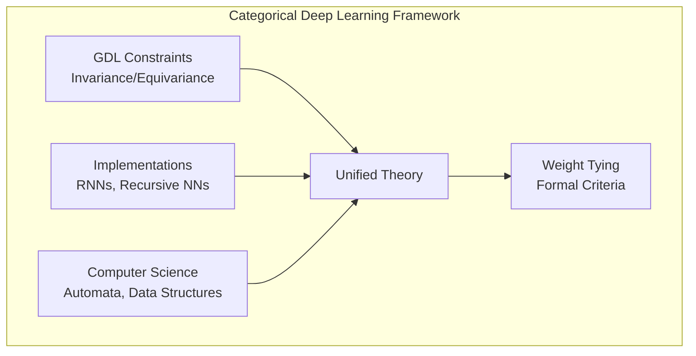

#### 1.3. The Power of Category Theory

Category theory may be conceived of as a battle-tested system of *interfaces* that are learned once, and then reliably applied across scientific fields. Originating in abstract mathematics, specifically algebraic topology, category theory has since proliferated, and been used to express ideas from numerous fields in a uniform manner, helping reveal their previously unknown shared aspects.

Fields where category theory has been applied include:
- Modern pure mathematics
- Systems theory (Capucci et al., 2022; Niu & Spivak, 2023)
- Bayesian learning (Braithwaite et al., 2023; Cho & Jacobs, 2019)
- Information theory and probability (Leinster, 2021; Bradley, 2021; Sturtz, 2015; Heunen et al., 2017; Perrone, 2022)

Recently category theory has started to be applied to machine learning, in:
- Automatic differentiation (Vákár & Smeding, 2022; Alvarez-Picallo et al., 2021; Gavranović, 2022; Elliott, 2018)
- Topological data analysis (Guss & Salakhutdinov, 2018)
- Natural language processing (Lewis, 2019)
- Causal inference (Jacobs et al., 2019; Cohen, 2022)
- Categorical picture of gradient-based learning (Cruttwell et al., 2022; Gavranović, 2024)

##### 1.3.1. Essential Concepts

**Definition 1.1 (Category).** A category, $\mathcal{C}$, consists of a collection of *objects*, and a collection of *morphisms* between pairs of objects, such that:

- For each object $A \in \mathcal{C}$, there is a unique *identity* morphism $\text{id}_A : A \to A$.
- For any two morphisms $f : A \to B$ and $g : B \to C$, there must exist a unique morphism which is their *composition* $g \circ f : A \to C$.

subject to the following conditions:

- **Unit laws**: For any morphism $f : A \to B$, it holds that $\text{id}_B \circ f = f \circ \text{id}_A = f$.
- **Associativity**: For any three composable morphisms $f : A \to B$, $g : B \to C$, $h : C \to D$, $h \circ (g \circ f) = (h \circ g) \circ f$.

We denote by $\mathcal{C}(A, B)$ the collection of all morphisms from $A \in \mathcal{C}$ to $B \in \mathcal{C}$.

**Example 1.2 (The Set Category).** $\mathbf{Set}$ is a category whose objects are sets, and morphisms are functions between them.

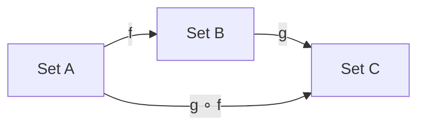

**Example 1.3 (Groups and monoids as categories).** A group, $G$, can be represented as a category, $\mathcal{B}G$, with a single object ($G$), and morphisms $g : G \to G$ corresponding to elements $g \in G$, where composition is given by the group's binary operation. Note that $G$ is a group if and only if these morphisms are isomorphisms, that is, for each $g : G \to G$ there exists $h : G \to G$ such that $h \circ g = g \circ h = \text{id}_G$. More generally, we can identify one-object categories, whose morphisms are not necessarily invertible, with monoids.

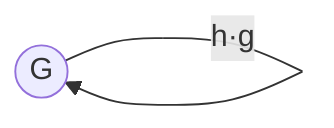

**Definition 1.4 (Functor).** Let $\mathcal{C}$ and $\mathcal{D}$ be two categories. Then, $F : \mathcal{C} \to \mathcal{D}$ is a *functor* between them, if it maps each object and morphism of $\mathcal{C}$ to a corresponding one in $\mathcal{D}$, and the following two conditions hold:

- For any object $A \in \mathcal{C}$, $F(\text{id}_A) = \text{id}_{F(A)}$.
- For any composable morphisms $f, g$ in $\mathcal{C}$, $F(g \circ f) = F(g) \circ F(f)$.

An *endofunctor* on $\mathcal{C}$ is a functor $F : \mathcal{C} \to \mathcal{C}$.

**Definition 1.5 (Natural transformation).** Let $F : \mathcal{C} \to \mathcal{D}$ and $G : \mathcal{C} \to \mathcal{D}$ be two functors between categories $\mathcal{C}$ and $\mathcal{D}$. A *natural transformation* $\alpha : F \Rightarrow G$ consists of a choice, for every object $X \in \mathcal{C}$, of a morphism $\alpha_X : F(X) \to G(X)$ in $\mathcal{D}$ such that, for every morphism $f : X \to Y$ in $\mathcal{C}$, it holds that $\alpha_Y \circ F(f) = G(f) \circ \alpha_X$.

The morphism $\alpha_X$ is called the *component* of the natural transformation $\alpha$ at the object $X$.

The components of a natural transformation assemble into "naturality squares", commutative diagrams:

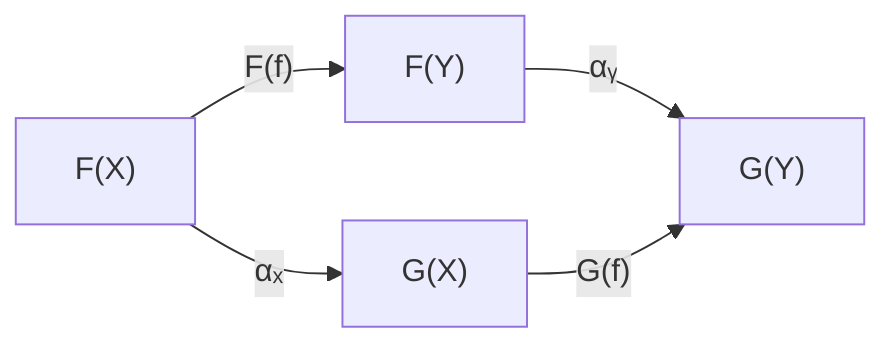

where a diagram *commutes* if, for any two objects, any two paths connecting them correspond to the same morphism.

---

### 2. From Monad Algebras to Equivariance

Having set up the essential concepts, we proceed on our quest to define a categorical framework which subsumes and generalises geometric deep learning (Bronstein et al., 2021). First, we will define a powerful notion (**monad algebra homomorphism**) and demonstrate that the special case of monads induced by *group actions* is sufficient to describe *geometric deep learning*. Generalising from monads and their algebras to arbitrary endofunctors and their algebras, we will find that our theory can express functions that process structured data from computer science (e.g. *lists* and *trees*) and behave in stateful ways like *automata*.

#### 2.1. Monads and their Algebras

**Definition 2.1 (Monad).** Let $\mathcal{C}$ be a category. A *monad* on $\mathcal{C}$ is a triple $(M, \eta, \mu)$ where $M : \mathcal{C} \to \mathcal{C}$ is an endofunctor, and $\eta : \text{id}_\mathcal{C} \Rightarrow M$ (**unit**) and $\mu : M \circ M \Rightarrow M$ (**multiplication**) are natural transformations (where here $\circ$ is functor composition), making the monad coherence diagrams commute.

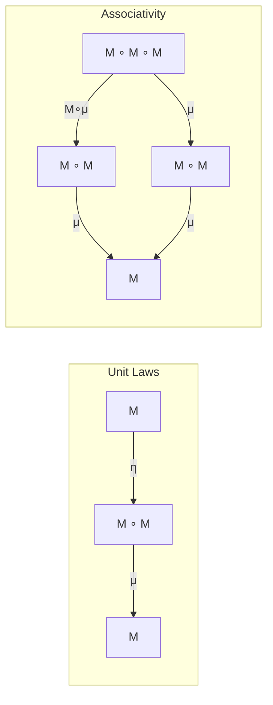

**Example 2.2 (Group action monad).** Let $G$ be a group. Then the triple $(G \times -, \eta, \mu)$ is a monad on $\mathbf{Set}$, where:

- $G \times - : \mathbf{Set} \to \mathbf{Set}$ is an endofunctor mapping a set $X$ to the set $G \times X$;
- $\eta : \text{id}_{\mathbf{Set}} \Rightarrow G \times - : \mathbf{Set} \to \mathbf{Set}$ whose component at a set $X$ is the function $x \mapsto (e, x)$ where $e$ is the identity element of the group $G$; and
- $\mu : G \times G \times - \Rightarrow G \times - : \mathbf{Set} \to \mathbf{Set}$ whose component at a set $X$ is the function $(g, h, x) \mapsto (gh, x)$ with the implicit multiplication that of the group $G$.

Group action monads are formal theories of group actions, but they do not allow us to actually execute them on data. This is what *algebras* do.

**Definition 2.3 (Algebra for a monad).** An *algebra* for a monad $(M, \eta, \mu)$ on a category $\mathcal{C}$ is a pair $(A, a)$, where $A \in \mathcal{C}$ is a *carrier object* and $a : M(A) \to A$ is a morphism of $\mathcal{C}$ (*structure map*) making the following diagrams commute:

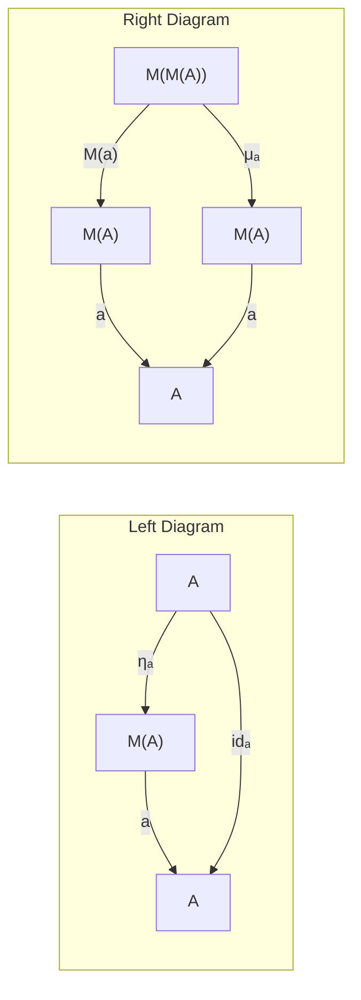

**Example 2.4 (Group actions).** Group actions for a group $G$ arise as algebras of the aforementioned group action monad $G \times -$. Consider the carrier $\mathbb{R}^{\mathbb{Z}_w \times \mathbb{Z}_h}$, thought of as data on a $w \times h$ grid, and any of the usual group actions on $\mathbb{Z}_w \times \mathbb{Z}_h$: translation, rotation, permutation, scaling, or reflections.

Each of these group actions induce an algebra on the carrier set $\mathbb{R}^{\mathbb{Z}_w \times \mathbb{Z}_h}$. For instance, the translation group $(\mathbb{Z}_w \times \mathbb{Z}_h, +, 0)$ induces the algebra:

$$\blacktriangleright: \mathbb{Z}_w \times \mathbb{Z}_h \times \mathbb{R}^{\mathbb{Z}_w \times \mathbb{Z}_h} \to \mathbb{R}^{\mathbb{Z}_w \times \mathbb{Z}_h}$$

defined as $((i', j') \blacktriangleright x)(i, j) = x(i - i', j - j')$. Here $x$ represents the grid data, $i, j$ specific pixel locations, and $i', j'$ the translation vector. We also specifically mention the trivial action of any group $\pi_X : G \times X \to X$ by projection.

**Definition 2.5 (M-algebra homomorphism).** Let $(M, \mu, \eta)$ be a monad on $\mathcal{C}$, and $(A, a)$ and $(B, b)$ be $M$-algebras. An *$M$-algebra homomorphism* $(A, a) \to (B, b)$ is a morphism $f : A \to B$ of $\mathcal{C}$ such that the following commutes:

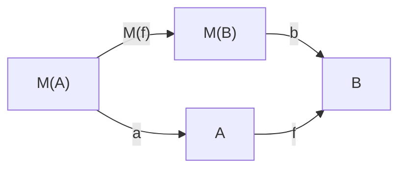

We recover equivariant maps as morphisms of algebras.

**Example 2.6 (Equivariant maps).** Equivariant maps are group action monad algebra homomorphisms. Consider any action from Example 2.4. An endomorphism of such an action—that is, a $G$-algebra on $\mathbb{R}^{\mathbb{Z}_w \times \mathbb{Z}_h}$—is an endomorphism of $\mathbb{R}^{\mathbb{Z}_w \times \mathbb{Z}_h}$ which induces a commutative diagram:

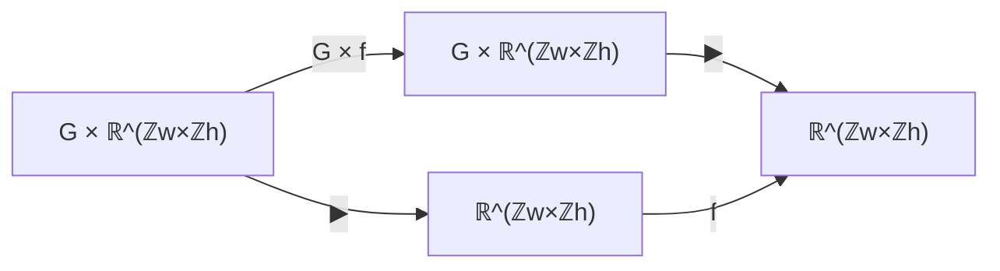

which, elementwise, unpacks to the equation:

$$f(g \blacktriangleright x) = g \blacktriangleright f(x)$$

The translation example, for instance, recovers the equation $f(((i', j') \blacktriangleright x)(i, j)) = (i', j') \blacktriangleright f(x)(i, j)$ which reduces to the usual constraint: $f(x(i - i', j - j')) = f(x)(i - i', j - j')$.

It's worth reflecting on the fact that we have just successfully derived the key aim of geometric deep learning: finding neural network layers that are *monad algebra homomorphisms of monads associated with group actions*!

**Remark 2.7.** When our monad is of the form $M \times -$, with $M$ a monoid, algebras are equivalent to $M$-actions, i.e., functors $\mathcal{B}M \to \mathbf{Set}$, where $\mathcal{B}M$ is the one-object category given in Example 1.3, and algebra morphisms are equivalent to natural transformations. So in this case, our definition of equivariance coincides with the functorial version given in de Haan et al. (2020a).

#### 2.2. Endofunctors and their (Co)algebras

Geometric deep learning, while elegant, is fundamentally constrained by the axioms of group theory. Monads and their algebras, however, are naturally generalised beyond group actions. Here we show how, by studying (co)algebras of arbitrary endofunctors, we can rediscover standard computer science constructs like lists, trees and automata.

**Definition 2.8 (Algebra for an endofunctor).** Let $\mathcal{C}$ be a category and $F : \mathcal{C} \to \mathcal{C}$ an endofunctor on $\mathcal{C}$. An *algebra* for $F$ is a pair $(A, a)$ where $A$ is an object of $\mathcal{C}$ and $a : F(A) \to A$ is a morphism of $\mathcal{C}$.

Note that, compared to Definition 2.3, there are no equations this time; $F$ is not equipped with any extra structure with which the structure map of an algebra could be compatible.

**Example 2.9 (Lists).** Let $A$ be a set, and consider the endofunctor $1 + A \times - : \mathbf{Set} \to \mathbf{Set}$. The set $\text{List}(A)$ of lists of elements of type $A$ together with the map $[\text{Nil}, \text{Cons}] : 1 + A \times \text{List}(A) \to \text{List}(A)$ forms an algebra of this endofunctor. Here $\text{Nil}$ and $\text{Cons}$ are two constructors for lists, allowing us to represent lists as the following datatype:

```haskell
data List a = Nil
            | Cons a (List a)
```

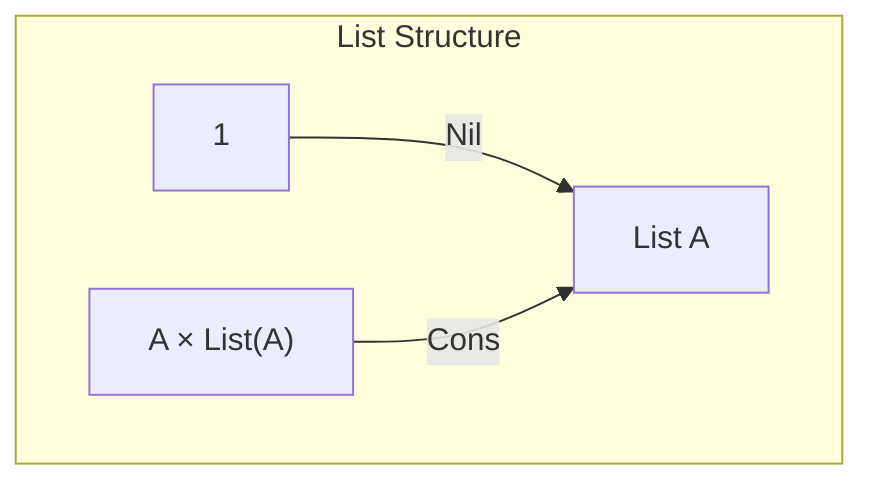

It describes $\text{List}(A)$ *inductively*, as being formed either out of the empty list, or an element of type $A$ and another list.

**Example 2.10 (Binary trees).** Let $A$ be a set. Consider the endofunctor $A + (-)^2 : \mathbf{Set} \to \mathbf{Set}$. The set $\text{Tree}(A)$ of binary trees with $A$-labelled leaves, together with the map $[\text{Leaf}, \text{Node}] : A + \text{Tree}(A)^2 \to \text{Tree}(A)$ forms an algebra of this endofunctor. Here $\text{Leaf}$ and $\text{Node}$ are constructors for binary trees:

```haskell
data Tree a = Leaf a
            | Node (Tree a) (Tree a)
```

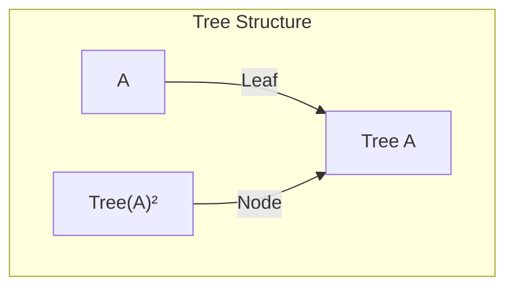

It describes $\text{Tree}(A)$ inductively, as being formed either out of a single $A$-labelled leaf or two subtrees.

Dually, we also study **coalgebras** for an endofunctor (where the structure morphism $a : A \to F(A)$ points the other way). Intuitively, while algebras offer us a way to model computation guaranteed to terminate, coalgebras offer us a way to model potentially infinite computation. They capture the semantics of programs whose guarantee is not termination, but rather *productivity* (Atkey & McBride, 2013), and as such are excellent for describing servers, operating systems, and automata (Rutten, 2000; Jacobs, 2016).

**Example 2.11 (Mealy machines).** Let $O$ and $I$ be sets of possible outputs and inputs, respectively. Consider the endofunctor $(I \to O \times -) : \mathbf{Set} \to \mathbf{Set}$. Then the set $\text{Mealy}_{O,I}$ of Mealy machines with outputs in $O$ and inputs in $I$, together with the map $\text{next} : \text{Mealy}_{O,I} \to (I \to O \times \text{Mealy}_{O,I})$ is a coalgebra of this endofunctor.

```haskell
data Mealy o i = MkMealy {
  next :: i -> (o, Mealy o i)
}
```

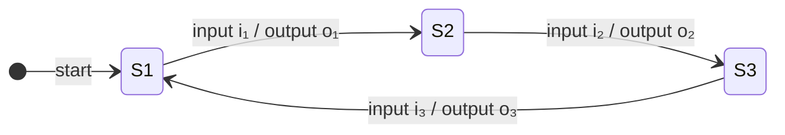

This describes Mealy machines *coinductively*, as systems which, given an input, produce an output and another Mealy machine.

**Example 2.12 (Folds over lists as algebra homomorphisms).** Consider the endofunctor $(1 + A \times -)$ from Example 2.9, and an algebra homomorphism from $(\text{List}(A), [\text{Nil}, \text{Cons}])$ to any other $(1 + A \times -)$-algebra $(X, [r_0, r_1])$:

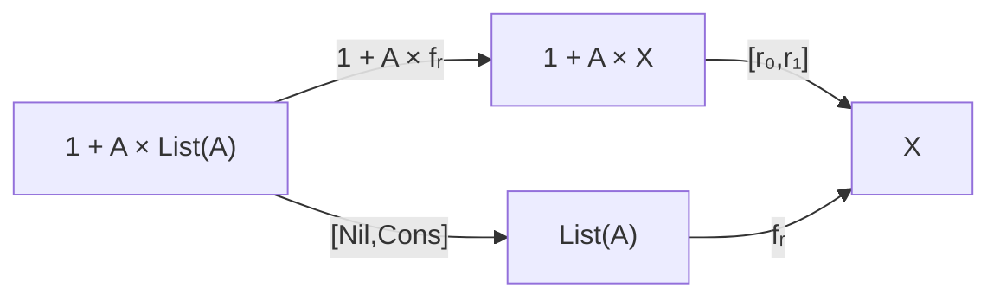

Then the map $f_r : \text{List}(A) \to X$ is, necessarily, a *fold* over a list, a concept from functional programming which describes how a single value is obtained by operating over a list of values. It is implemented by recursion on the input:

```haskell
f_r :: List a -> x
f_r Nil = r_0 ()
f_r (Cons h t) = r_1 h (f_r t)
```

This recursion is *structural* in nature, meaning it satisfies the following two equations:

$$f_r(\text{Nil}) = r_0(\bullet) \tag{1}$$
$$f_r(\text{Cons}(h, t)) = r_1(h, f_r(t)) \tag{2}$$

Equation (1) tells us that we get the same result if we apply $f_r$ to $\text{Nil}$ or apply $r_0$ to the unique element of the singleton set. Equation (2) tells us that, starting with the head and tail of a list, we get the same result if we concatenate the head to the tail, and then process the entire list with $f_r$, or if we process the tail first with $f_r$, and then combine the result with the head using $r_1$.

It is important to remark that these equations **generalise equivariance constraints** over a list structure. Both group equivariance and Equations (1) and (2) intuitively specify a function that is predictably affected by certain operations—but for the case of lists, these operations (concatenating) are not group actions, as attaching an element to the front of the list does not leave the list unchanged.

**Remark 2.13.** Interestingly, given an algebra $(X, [r_0, r_1])$, there can only ever be *one* algebra homomorphism from lists to it! This is because $(\text{List}(A), [\text{Nil}, \text{Cons}])$ is an *initial object* in the category of $(1 + A \times -)$-algebras.

**Example 2.14 (Tree folds as algebra homomorphisms).** Consider the endofunctor $A + (-)^2$ from Example 2.10, and an algebra homomorphism from $(\text{Tree}(A), [\text{Leaf}, \text{Node}])$ to any other $(A + (-)^2)$-algebra $(X, [r_0, r_1])$:

```haskell
f_r :: Tree a -> x
f_r (Leaf a) = r_0 a
f_r (Node l r) = r_1 (f_r l) (f_r r)
```

This means that it satisfies the following two equations:

$$f_r(\text{Leaf}(a)) = r_0(a) \tag{3}$$
$$f_r(\text{Node}(l, r)) = r_1(f_r(l), f_r(r)) \tag{4}$$

These can also be thought as describing generalised equivariance over binary trees, analogously to lists.

**Example 2.15 (Unfolds as coalgebra homomorphisms).** Consider the endofunctor $(I \to O \times -)$ from Example 2.11, and a coalgebra homomorphism from $(\text{Mealy}_{O,I}, \text{next})$ to any other $(I \to O \times -)$-coalgebra $(X, n)$:

```haskell
f_n :: x -> Mealy o i
f_n x = MkMealy
  \i -> let (o', x') = n x i
        in (o', f_n x')
```

This is again structural in nature, satisfying:

$$n(x)(i)_1 = \text{next}(f_n(x))(i)_1 \tag{5}$$
$$f_n(n(x)(i)_2) = \text{next}(f_n(x))(i)_2 \tag{6}$$

Equation (5) tells us that the output of the Mealy machine produced by $f_n$ at state $x$ and input $i$ is given by the output of $n$ at state $x$ and input $i$, and Equation (6) tells us that the next Mealy machine produced at $x$ and $i$ is the one produced by $f_n$ at $n(x)_2(i)$.

This, too, generalises equivariance constraints, now describing an interactive automaton which is by no means invertible. Instead, it is dynamic in nature, producing outputs which are dependent on the current state of the machine and previously unknown inputs.

#### 2.3. Where to Next?

Let's take a step back and understand what we've done. We have shown that an existing categorical framework uniformly captures a number of different data structures and automata, as particular (co)algebras of an endofunctor. By choosing a well-understood data structure, we induce a structural constraint on the control flow of the corresponding neural network, by utilising homomorphisms of these endofunctor (co)algebras.

This is concrete evidence for our position—that **categorical algebra homomorphisms are suitable for capturing various constraints one can place on deep learning architectures**.

However, this construct leaves much to be desired. One major issue is that, to prescribe any notion of weight sharing, for all of these examples we have implicitly assumed homomorphisms to be linear transformations by placing them into the category $\mathbf{Vect}$. But most neural networks aren't simply linear maps.

How can we explicitly model parameters and non-linear maps, without abandoning the presented categorical framework? Furthermore, in practice—with recurrent or recursive neural networks, for instance—there are established techniques for weight sharing. Can we establish formal criteria for when these techniques are correct?

Just as how we generalised GDL to the setting of category theory, we can go further: to the setting of **2-categories**—the setting we use to study parametric morphisms.

---

### 3. 2-Categories and Parametric Morphisms

While category theory is a powerful framework, it leaves much to be desired in terms of higher-order relationships between morphisms. It only deals with *sets* of morphisms, with no possible way to compare elements of these sets. This is where the theory of **2-categories** comes in, which deals with an entire *category* of morphisms.

While in a (1-)category, one has objects and morphisms between objects, in a 2-category one has:
- Objects (known as *0-morphisms*)
- Morphisms between objects (*1-morphisms*)
- Morphisms between morphisms (*2-morphisms*)

We have, in fact, already secretly seen an instance of a 2-category, $\mathbf{Cat}$, when defining the essential concepts of category theory. Specifically, in $\mathbf{Cat}$, objects are categories, morphisms are functors between them, and 2-morphisms are natural transformations between functors.

#### 3.1. The 2-category Para

In this section we define an established 2-category $\mathbf{Para}$ (Cruttwell et al., 2022; Capucci et al., 2022), and proceed to unpack the manner which we posit weight sharing can be modelled formally in it.

While it shares objects with the category $\mathbf{Set}$, its 1-morphisms are not functions, but **parametric functions**. That is, a 1-morphism $A \to B$ here consists of a pair $(P, f)$, where $P \in \mathbf{Set}$ and $f : P \times A \to B$.

**Generalised definition** (from monoidal category $(\mathcal{M}, \otimes, I)$ and an $\mathcal{M}$-actegory $\mathcal{C}$, define $\text{Para}_{\blacktriangleright}(\mathcal{C})$):

- **Objects**: Objects of $\mathcal{C}$
- **1-morphisms** $X \to Y$: Pairs $(P, f)$ where $P \in \mathcal{M}$ and $f : P \blacktriangleright X \to Y$
- **2-morphisms** $(P, f) \Rightarrow (P', f')$: Morphisms $r : P' \to P$ making the triangle commute

**Graphical representation:** $\mathbf{Para}$ morphisms admit an elegant graphical formalism. Parameters ($P$) are drawn vertically, signifying that they are part of the morphism, and not objects.

```
     │P
     ▼
A ──►[f]──► B
```

The 2-category $\mathbf{Para}$ models the algebra of composition of neural networks; the sequential composition of parametric morphisms composes the parameter spaces in parallel.

**Composition:** For morphisms $(P, f) : X \to Y$ and $(Q, g) : Y \to Z$, their composition is $(Q \otimes P, h)$ where $h$ is the composite:

$$(Q \otimes P) \blacktriangleright X \xrightarrow{\mu_{Q,P,X}} Q \blacktriangleright (P \blacktriangleright X) \xrightarrow{Q \blacktriangleright f} Q \blacktriangleright Y \xrightarrow{g} Z$$

```
     │P          │Q          │P⊗Q
     ▼           ▼           ▼
A ──►[f]──► B ──►[g]──► C  = A ──►[h]──► C
```

**Reparameterization (2-morphisms).** A 2-morphism $r : P' \to P$ in $\mathcal{M}$ gives a reparameterization:

```
    ┌───┐           ┌────┐
    │P' │           │ P' │
    └─┬─┘           └──┬─┘
      │                │ r
      │ f'             ▼
      │             ┌──┴──┐
      │      =      │  P  │
      │             └──┬──┘
      │                │ f
   A──┴───►B        A──┴───►B
```

The 2-morphisms in $\mathbf{Para}$ capture **reparameterisations** between parametric functions. Importantly, this allows for the explicit treatment of **weight tying**, where a parametric morphism $(P \times P, f)$ can have its weights tied by precomposing with the copy map $\Delta_P : P \to P \times P$.

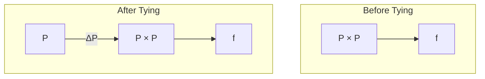

This 2-category is one of the key components in the categorical picture of gradient-based learning (Cruttwell et al., 2022). But we hypothesise that more is true:

> **Position:** It is our position that the 2-category $\mathbf{Para}$ and 2-categorical algebra valued in it provide a **formal theory of neural network architectures**, establish **formal criteria for weight tying correctness** and **inform design of new architectures**.

#### 3.2. 2-dimensional Categorical Algebra

2-category theory is markedly richer than 1-category theory. While diagrams in a 1-category either commute or do not commute, in a 2-category, they serve as a 1-skeleton to which 2-morphisms attach. In any 2-category a square may:

- **Commute** (paths are equal)
- **Pseudo-commute** (paths are isomorphic)
- **Lax-commute** (there is a 2-morphism from one to the other in one direction)
- **Oplax-commute** (there is a 2-morphism in the other direction)

In the long run, we expect that *all* of these notions will apply to, either explaining or specifying, aspects of neural architecture past, present and future. Focusing on just one of them, the **lax algebras** are sufficient to derive recursive, recurrent, and similar neural networks from first principles.

Notably, morphisms of lax algebras are also expressive enough to capture **1-cocycles**, used to formalise asynchronous neural networks in (Dudzik et al., 2024).

**Theorem G.10 (Lax (co)algebras for Para(T) induce comonoids).** Let $(\mathcal{C}, \blacktriangleright)$ be a $\mathcal{M}$-actegory and $T : \mathcal{C} \to \mathcal{C}$ a strong actegorical monad on $\mathcal{C}$. Consider a lax algebra $(A, (P, a), \epsilon_A, \delta_A)$ for the induced 2-monad $\mathbf{Para}(T)$. Then $P$ is a comonoid in $\mathcal{M}$ where $\epsilon_A$ is the data of its counit, and $\delta_A$ the data of its comultiplication, and the comonoid laws follow from lax algebra coherence conditions.

The fact that we can duplicate or delete entries in vectors—the essence of tying weights—is the formal face of this comonoid structure.

We can now describe the universal properties of recurrent, recursive, and similar models: **they are lax algebras for free parametric monads generated by parametric endofunctors**! Having lifted the concept of algebra introduced in Part 2 into 2-categories, we can now describe several influential neural networks fully (not just their individual layers!) from first principles of functional programming.

---

### 4. New Horizons

Our framework gives the correct definition of numerous variants of structured networks as universal parametric counterparts of known notions in computer science. This immediately opens up innumerable avenues for research.

#### Generalised Equivariance

Any results of categorical deep learning as presented here rely on *choosing* the right category to operate in; much like results in geometric deep learning relied on the choice of symmetry group. However, we have seen that monad algebras—which generalise equivariance constraints—can be parametric, and lax. As a consequence, the kinds of equivariance constraints we can learn become more general: we hypothesise neural networks that can learn not merely conservation laws (as in Alet et al. (2021)), but **verifiably correct logical argument, or code**.

This has ramifications for code synthesis: we can, for example, specify neural networks that learn only well-typed functions by choosing appropriate algebras as their domain and codomain.

#### Containers and Type-Safe Design

By choosing polynomial functors as endofunctors we get access to *containers* (Abbott et al., 2003; Altenkirch et al., 2010), a uniform way to program with and reason about datatypes and polymorphic functions. By combining these insights with recent advances enabling purely functional differentiation through inductive and coinductive types (Nunes & Vákár, 2023), we open new vistas for type-safe design and implementation of neural networks in functional languages.

#### Beyond Individual Layers

One major limitation of geometric deep learning was that it was typically only able to deal with individual neural network layers, owing to its focus on linear equivariant functions. Within our framework, we can reason about architectural blocks spanning multiple layers—as evidenced by our weight tying examples—and hence we believe CDL should enable us to have a theory of architectures which properly treats nonlinearities.

#### Equitable AI Systems

Our framework also offers a proactive path towards equitable AI systems. GDL already enables the architectural imposition of protected classes invariance. This deals, at least partially, both with issues of inequity in training data and inequity in algorithms since such an invariant model is, by construction, exclusively capable of inference on the dimensions of latent representation which are orthogonal to protected class.

With CDL, we hope to enable even finer grained control. By way of categorical logic, we hope that CDL will lead us to a new and deeper understanding of the relationship between architecture and logic, in particular clarifying the logics of inductive bias. We hope that our framework will eventually allow us to specify the kinds of arguments the neural networks can use to come to their conclusions. This is a level of expressivity permitting reliable use for assessing bias, fairness in the reasoning done by AI models deployed at scale.

We thus believe that this is the right path to AI compliance and safety, and not merely explainable, but **verifiable AI**.

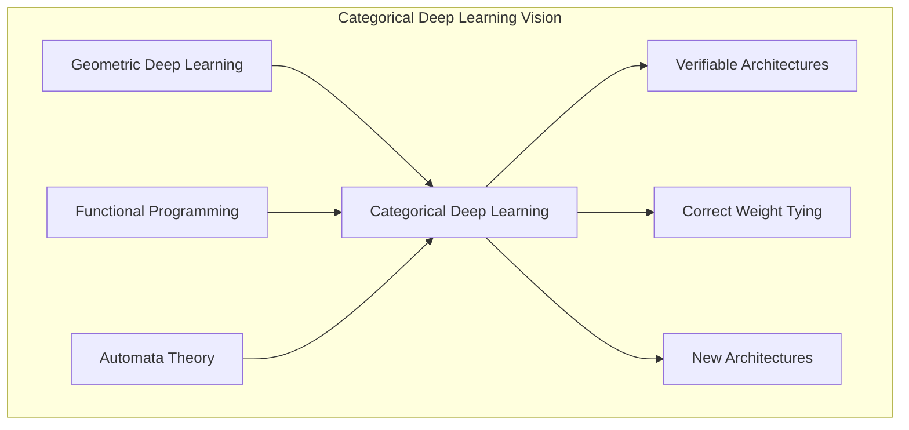

---

### Architectures-as-Algebras Overview

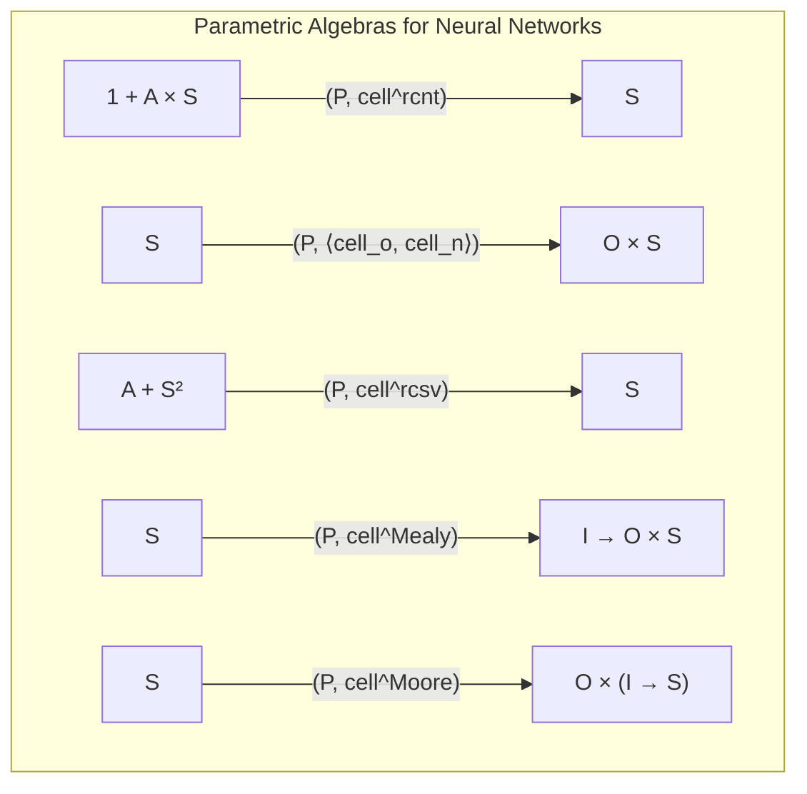

| Architecture | Endofunctor | Type | Haskell Code |
|--------------|-------------|------|--------------|
| Folding RNN | $1 + A \times -$ | Algebra | Lists |
| Unfolding RNN | $O \times -$ | Coalgebra | Streams |
| Recursive NN | $A + (-)^2$ | Algebra | Binary Trees |
| Full RNN (Mealy) | $I \to O \times -$ | Coalgebra | Mealy Machine |
| Moore Machine NN | $O \times (I \to -)$ | Coalgebra | Moore Machine |

---

### Appendix A: Category Theory Basics

**Definition A.1 (Equivalence).** An *equivalence* between two categories $\mathcal{C}$ and $\mathcal{D}$, written $\mathcal{C} \xrightarrow{\sim} \mathcal{D}$, consists of a pair of functors $F : \mathcal{C} \to \mathcal{D}$ and $G : \mathcal{D} \to \mathcal{C}$ together with natural isomorphisms $F \circ G \cong 1_\mathcal{D}$ and $G \circ F \cong 1_\mathcal{C}$.

**Definition A.2 (Initial object).** An object $I$ in a category $\mathcal{C}$ is called *initial* if for every $X \in \mathcal{C}$ it naturally holds that $\mathcal{C}(I, X) \cong 1$, meaning that there is only one map of type $I \to X$.

**Definition A.3 (Terminal object).** An object $T$ in a category $\mathcal{C}$ is called *terminal* if for every $X \in \mathcal{C}$ it naturally holds that $\mathcal{C}(X, T) \cong 1$, meaning that there is only one map of type $X \to T$.

**Definition A.4 (Limit).** For categories $\mathcal{J}$ and $\mathcal{C}$, a *diagram of shape $\mathcal{J}$* in $\mathcal{C}$ is a functor $D : \mathcal{J} \to \mathcal{C}$. A *cone* to a diagram $D$ consists of an object $C \in \mathcal{C}$ and a natural transformation from a functor constant at $C$ to the functor $D$, i.e., a family of morphisms $c_j : C \to D(j)$ for each object $j \in \mathcal{J}$, such that for any $f : i \to j$ in $\mathcal{C}$ the following diagram commutes:

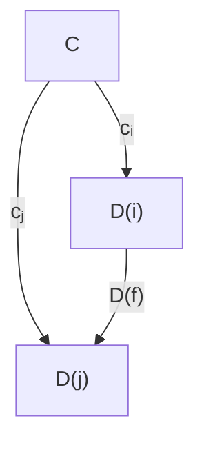

The *limit* of a diagram $D$, written $\varprojlim D$, is the terminal object in the category $\text{Cone}(D)$ of cones to $D$ and morphisms between them.

**Definition A.5 (Colimit).** The *colimit* $\varinjlim D$ of a diagram $D : \mathcal{J}^{op} \to \mathcal{C}$ is the initial object in the category $\text{Cocone}(D)$ of cocones to $D$, where a cocone $(C, c_j : D(j) \to C)$ has the dual property of a cone with the morphisms reversed.

---

### Appendix B: 1-Categorical Algebra

**Definition B.1 (Monad coherence diagrams).** A triple $(M, \eta, \mu)$ of:

- an endofunctor $M : \mathcal{C} \to \mathcal{C}$;
- a natural transformation $\eta : \text{id}_\mathcal{C} \Rightarrow M$; and
- a natural transformation $\mu : M \circ M \Rightarrow M$

constitute a **monad** if the following diagrams commute:

**Unit laws:**
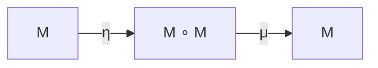

**Associativity:**
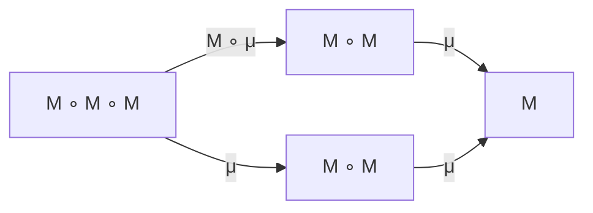

**Definition B.2 (Coalgebra for an endofunctor).** Let $\mathcal{C}$ be a category and $F$ an endofunctor on $\mathcal{C}$. A *coalgebra* for $F$ is a pair $(A, a)$ where $A$ is an object of $\mathcal{C}$ and $a : A \to F(A)$ is a morphism of $\mathcal{C}$.

#### B.1. Well-pointed Endofunctors and Algebraically Free Monads

**Definition B.3.** A *pointed endofunctor* $(F, \sigma)$ comprises an endofunctor $F : \mathcal{C} \to \mathcal{C}$, and a natural transformation $\sigma : \text{id}_\mathcal{C} \Rightarrow F$. A pointed endofunctor is said to be *well-pointed* if the whiskering of $F$ and $\sigma$ either from the left or the right gives the same result.

**Definition B.8.** Given an endofunctor $F : \mathcal{C} \to \mathcal{C}$, an *algebraically free monad* on $F$ is a monad $\text{FreeMnd}(F)$ together with an equivalence of categories $\text{Alg}_{\text{Endo}}(F) \xrightarrow{\sim} \text{Alg}_{\text{Mnd}}(\text{FreeMnd}(F))$ which preserves the respective functors to $\mathcal{C}$ that forget the algebraic structure.

**Proposition B.18 ((Co)free (co)monads, explicitly).** Let $F : \mathcal{C} \to \mathcal{C}$ be an endofunctor. Then $\text{FreeMnd}(F)$, the free monad on $F$ is given by:

$$\text{FreeMnd}(F)(Z) = \text{Fix}(X \mapsto F(X) + Z)$$

Dually, we compute $\text{CofreeCmnd}(F)$, the cofree comonad on $F$ as:

$$\text{CofreeCmnd}(F)(Z) = \text{Fix}(X \mapsto F(X) \times Z)$$

**Example B.19 (Free monad on $1 + A \times -$).** Free monad on the endofunctor $1 + A \times -$ is $\text{List}_{-+1}(A) : \mathbf{Set} \to \mathbf{Set}$, the endofunctor mapping an object $Z$ to the set $\text{List}_{Z+1}(A)$ of lists of elements of type $A$ whose last element is not $[]$, i.e., an element of type $1$, but instead an element of type $Z + 1$.

**Example B.20 (Free monad on $A + (-)^2$).** The free monad on the endofunctor $A + (-)^2$ is given by $\text{Tree}(A + -) : \mathbf{Set} \to \mathbf{Set}$, mapping a set $Z$ to the set of trees with $A + Z$ labelled leaves.

---

### Appendix C: Additional Geometric Deep Learning Examples

#### C.1. Permutation-equivariant Learning on Graphs

Leading to graph neural networks (Veličković, 2023):

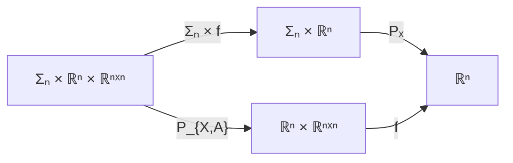

In this case:
- The group $G = \Sigma_n$ is the permutation group of $n$ elements
- The carrier object includes (scalar) node features $\mathbb{R}^n$ and adjacency matrices $\mathbb{R}^{n \times n}$
- The structure map $P_{X,A} : \Sigma_n \times \mathbb{R}^n \times \mathbb{R}^{n \times n} \to \mathbb{R}^n \times \mathbb{R}^{n \times n}$ executes the permutation: $P_{X,A}(\sigma, X, A) = (P(\sigma)X, P(\sigma)AP(\sigma)^\top)$

#### C.2. Rotation-equivariant Learning on Spheres

Leading to the first layer of spherical CNNs (Cohen et al., 2018):

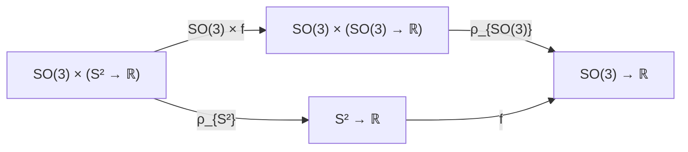

In this case:
- The group $G = SO(3)$ is the special orthogonal group of 3D rotations
- The structure map $\rho_{S^2} : SO(3) \times (S^2 \to \mathbb{R}) \to (S^2 \to \mathbb{R})$ executes a 3D rotation on spherical data

#### C.3. G-equivariant Learning on G

Leading to G-CNNs (Cohen & Welling, 2016):

```mermaid
graph LR
    GG1["G × (G → ℝ)"] -->|"G × f"| GG2["G × (G → ℝ)"]
    GG1 -->|"A_G"| G1["G → ℝ"]
    GG2 -->|"A_G"| G2["G → ℝ"]
    G1 -->|"f"| G2
```

Both algebras' structure map follows the execution of the regular representation of $G$, $A_G : G \times (G \to \mathbb{R}) \to (G \to \mathbb{R})$, by composition: $A_G(g, \psi)(h) = \psi(g^{-1}h)$.

---

### Appendix H: Weight Tying Examples

#### H.1. Examples from Geometric Deep Learning

**Example H.1 (Linear equivariant layers for a pair of pixels).** Consider the category $\mathbf{Vect}$ of finite-dimensional vector spaces and linear maps. For simplicity, we assume the carrier set for our data is $\mathbb{R}^{\mathbb{Z}_2}$, which is a pair of pixels. Consider a linear endofunction on such data, $f_W : \mathbb{R}^{\mathbb{Z}_2} \to \mathbb{R}^{\mathbb{Z}_2}$. This function can be represented as a multiplication with a $2 \times 2$ matrix:

$$W = \begin{bmatrix} w_1 & w_3 \\ w_2 & w_4 \end{bmatrix}$$

Now consider the group of 1D translations $(\mathbb{Z}_2, +, 0)$—which amounts to pixel swaps—and the induced action $\blacktriangleright$ on $\mathbb{R}^{\mathbb{Z}_2}$. If $f : \mathbb{R}^{\mathbb{Z}_2} \to \mathbb{R}^{\mathbb{Z}_2}$ is equivariant with respect to $\blacktriangleright$, then for any input $[x_1, x_2] \in \mathbb{R}^{\mathbb{Z}_2}$ it must hold that:

$$\begin{bmatrix} w_1 x_2 + w_2 x_1 \\ w_3 x_2 + w_4 x_1 \end{bmatrix} = \begin{bmatrix} w_3 x_1 + w_4 x_2 \\ w_1 x_1 + w_2 x_2 \end{bmatrix} \tag{11}$$

This implies that $w_3 = w_2$ and $w_4 = w_1$, meaning every $W$ is of the form:

$$\begin{bmatrix} w_1 & w_2 \\ w_2 & w_1 \end{bmatrix}$$

where the weight tying makes the matrix a symmetric one. Any neural network $f_W$ satisfying this constraint will be a *linear translation equivariant layer* over $\mathbb{Z}_2$.

> **⚠️ CAREFUL — derivation cross-check (Equivariance, Eq. 11).** The LHS as written ($w_1 x_2 + w_2 x_1$, etc.) reads as $W^\top (x_2, x_1)^\top$ rather than the more natural $W(x_2, x_1)^\top = (w_1 x_2 + w_3 x_1, w_2 x_2 + w_4 x_1)^\top$ given the matrix $W = \begin{bmatrix} w_1 & w_3 \\ w_2 & w_4 \end{bmatrix}$ at the top of the example. The end result (symmetric tied matrix $\begin{bmatrix} w_1 & w_2 \\ w_2 & w_1 \end{bmatrix}$) is the well-known correct symmetric/circulant form for the $\mathbb{Z}_2$ swap, but **rederive from your own conventions before citing intermediate steps**. The structural conclusion (circulant matrix = CNN) is correct; only the index-mechanics in the intermediate equation deserve a fresh derivation.

**Remark H.2 (Circulants and CNNs).** Note that this concept generalises to larger input domains (e.g., $\mathbb{R}^{\mathbb{Z}_k}$ for $k > 2$). Generally, it is a well-known fact in signal processing that, for $f_W$ to satisfy a linear translation equivariance constraint, $W$ must be a *circulant matrix*. Circulant matrices are known in neural networks as convolutional layers, the essence of modern CNNs.

**Example H.3 (Invariant maps).** Invariant maps are also $(G \times -)$-algebra homomorphisms where the codomain is a trivial group action:

```mermaid
graph LR
    GR1["G × ℝ^(ℤw×ℤh)"] -->|"G × f"| GR2["G × ℝ^(ℤw×ℤh)"]
    GR1 -->|"▶"| R1["ℝ^(ℤw×ℤh)"]
    GR2 -->|"π₂"| R2["ℝ^(ℤw×ℤh)"]
    R1 -->|"f"| R2
```

Elementwise, this unpacks to:

$$f(g \blacktriangleright x) = f(x)$$

##### Worked Invariance Example (from summary Doc 2, §7.7)

For **invariance** (codomain has trivial action) with the same $\mathbb{Z}_2$ swap setup, the summary derives:

> "Constraint gives: $w_1 = w_2$ and $w_3 = w_4$:
> $$W = \begin{bmatrix} w_1 & w_3 \\ w_1 & w_3 \end{bmatrix}$$
> Each pixel output is the same — effectively a dot product eliminating grid structure."

> **⚠️ CAREFUL — invariance derivation does NOT match a standard re-derivation.** Working from $W = \begin{bmatrix} w_1 & w_3 \\ w_2 & w_4 \end{bmatrix}$ and requiring $f(x_1, x_2) = f(x_2, x_1)$ component-wise:
> - $w_1 x_1 + w_3 x_2 = w_1 x_2 + w_3 x_1 \;\Rightarrow\; w_1 = w_3$
> - $w_2 x_1 + w_4 x_2 = w_2 x_2 + w_4 x_1 \;\Rightarrow\; w_2 = w_4$
>
> The correct invariance constraint is therefore $w_1 = w_3 \text{ and } w_2 = w_4$, yielding $W = \begin{bmatrix} w_1 & w_1 \\ w_2 & w_2 \end{bmatrix}$ (**columns** identical, since each output coordinate is a symmetric function of the inputs). The summary writes "$w_1 = w_2 \text{ and } w_3 = w_4$" with $\begin{bmatrix} w_1 & w_3 \\ w_1 & w_3 \end{bmatrix}$ (**rows** identical), which is internally consistent but encodes a different constraint than swap-invariance. **Rederive from scratch before citing.**
>
> **Reconciled with the PDF (2026-07-13):** this is a *convention* mismatch, not a computational error in the paper. The paper *displays* $W = \begin{bmatrix} w_1 & w_3 \\ w_2 & w_4 \end{bmatrix}$ (column-major) but does the eq. (11)/(12) arithmetic *row-major*; under a single consistent reading the paper's shared-**rows** result follows and is correct, while the column-major re-derivation above gives shared-**columns**. Both are right under their own convention. The structural conclusion (invariance ⇒ weight sharing ⇒ CNN) is convention-independent.

#### H.2. Examples from Automata Theory

##### H.2.1. Streams

**Example H.4 (Streams).** Let $O$ be a set of outputs. Consider the endofunctor $O \times - : \mathbf{Set} \to \mathbf{Set}$. Then the set $\text{Stream}(O)$ of streams with outputs $O$, together with the map $\langle \text{output}, \text{next} \rangle : \text{Stream}(O) \to O \times \text{Stream}(O)$ forms a coalgebra of this endofunctor:

```haskell
data Stream o = MkStream {
  output :: o
  next :: Stream o
}
```

**Example H.5 (Unfolds to streams as coalgebra homomorphisms).** Consider a coalgebra homomorphism from any $(O \times -)$-coalgebra $(X, \langle o, n \rangle)$ into $(\text{Stream}(O), \langle \text{output}, \text{next} \rangle)$:

```haskell
f_{o,n} :: x -> Stream o
f_{o,n} x = MkStream (o x) (f_{o,n} (n x))
```

This corecursion satisfies:

$$o(x) = \text{output}(f_{o,n}(x)) \tag{13}$$
$$f_{o,n}(n(x)) = \text{next}(f_{o,n}(x)) \tag{14}$$

##### H.2.2. Moore Machines

**Example H.7 (Moore machines).** Let $O$ and $I$ be sets of outputs and inputs, respectively. Consider the endofunctor $O \times (I \to -) : \mathbf{Set} \to \mathbf{Set}$. Then the set $\text{Moore}_{O,I}$ of Moore Machines with $O$-labelled outputs and $I$-labelled inputs together with the map $\langle \text{output}, \text{next} \rangle : \text{Moore}_{O,I} \to O \times (I \to \text{Moore}_{O,I})$ forms a coalgebra:

```haskell
data Moore o i = MkMoore {
  output :: o,
  nextStep :: (i -> Moore o i)
}
```

---

### Appendix I: Parametric 2-endofunctors and their Algebras

**Example I.1 (Folding RNN cell).** Consider the endofunctor $1 + A \times -$ from Example 2.9. Via strength we can form the 2-endofunctor $\mathbf{Para}(1 + A \times -) : \mathbf{Para}(\mathbf{Set}) \to \mathbf{Para}(\mathbf{Set})$. Then a **folding recurrent neural network** arises as its algebra.

An algebra here consists of:
- The carrier set $S$ (hidden state)
- A parametric map $(P, \text{cell}^{\text{rcnt}}) \in \mathbf{Para}(\mathbf{Set})(1 + A \times S, S)$

Via the isomorphism $P \times (1 + A \times S) \cong P + P \times A \times S$ we can break $\text{cell}^{\text{rcnt}}$ into two pieces:
- The choice of the initial hidden state $\text{cell}^{\text{rcnt}}_0 : P \to S$
- The folding recurrent neural network cell $\text{cell}^{\text{rcnt}}_1 : P \times A \times S \to S$

```
Folding RNN cell:

     │P          │P
     ▼           ▼
   ┌───┐       ┌───┐
S─►│   │─►S    │   │─►S
   └───┘   A─►─┘   └─►─A
```

**Example I.2 (Recursive NN cell).** Consider the endofunctor $A + (-)^2$ from Example 2.10. A **recursive neural network** arises as its algebra, consisting of:
- The carrier set $S$
- A parametric map $(P, \text{cell}^{\text{rcsv}}) \in \mathbf{Para}(\mathbf{Set})(A + S^2, S)$

Via isomorphism $P \times (A + S^2) \cong P + P \times A \times S^2$:
- $\text{cell}^{\text{rcsv}}_0 : P \to S$ — initial state
- $\text{cell}^{\text{rcsv}}_1 : P \times A \times S^2 \to S$ — recursive cell

**Example I.3 (Unfolding RNN cell).** Consider the endofunctor $O \times -$ from Example H.4. An **unfolding recurrent neural network** arises as its coalgebra.

- $\text{cell}_o : P \times S \to O$ — computes output
- $\text{cell}_n : P \times S \to S$ — computes next state

**Example I.4 (Mealy machine cell / Full RNN cell).** Consider the endofunctor $I \to O \times -$ from Example 2.11. A **Mealy machine cell** arises as its coalgebra. We interpret it as a full recurrent neural network consuming a hidden state $S$, input $I$ and producing an output $O$ and an updated hidden state $S$.

This suggests that **recurrent neural networks can be thought of as learnable Mealy machines**, a perspective seldom advocated for in the literature.

**Example I.5 (Moore machine cell).** Consider the endofunctor $O \times (I \to -)$ from Example H.7. A **Moore machine cell** arises as its coalgebra.

- $\text{cell}^{\text{Moore}}_o : P \times S \to O$ — output (independent of current input)
- $\text{cell}^{\text{Moore}}_n : P \times S \times I \to S$ — next state

---

### Appendix J: Unrolling Neural Networks via Transfinite Construction

**Example J.1 (Iterated Folding RNN).** Consider an algebra $(P, \text{cell}^{\text{rcnt}})$ of $\mathbf{Para}(1 + A \times -)$, i.e., a folding RNN cell. Its unrolling is a $\mathbf{Para}(1 + A \times -)$-algebra homomorphism:

```mermaid
graph LR
    LA["1 + A × List(A)"] -->|"Para(1+A×−)((P,f_rcnt))"| AX["1 + A × X"]
    LA -->|"γ([Nil,Cons])"| L["List(A)"]
    AX -->|"(P,cell^rcnt)"| X["X"]
    L -->|"(P,f_rcnt)"| X
```

with reparameterisation $\Delta_P : P \to P \times P$ (the copy map).

Here the map $f_{\text{rcnt}}$ is the parametric analogue of a fold:

```haskell
f_rcnt :: (p, List a) -> x
f_rcnt p Nil = cell^rcnt p (inl ())
f_rcnt p (Cons a as) = cell^rcnt p (inr a (f_rcnt p as))
```

We can see that $f_{\text{rcnt}}$ is structurally recursive: it processes the head of the list by applying $\text{cell}^{\text{rcnt}}$ to the parameter $p$ and the output of $f_{\text{rcnt}}$ with the same parameter, and the tail of the same list.

**Unrolled Folding RNN Diagram:**

```
        ┌──────────────────────────────────────────┐
        │                    P                     │
        └──────────────────────────────────────────┘
                │         │         │         │
                ▼         ▼         ▼         ▼
A₁ ──►[cell]──►[cell]──►[cell]──►[cell]──► X
              ▲         ▲         ▲
              A₂        A₃        A₄
```

**Example J.2 (Iterated unfolding RNN).** Consider a coalgebra $(P, \langle \text{cell}_o, \text{cell}_n \rangle)$ of $\mathbf{Para}(O \times -)$. Its unrolling produces:

```haskell
f_{o,n} :: (p, x) -> Stream o
f_{o,n} p x = MkStream (cell_o p x) (f_{o,n} p (cell_n x))
```

**Unrolled Unfolding RNN Diagram:**

```
        ┌─────────────────────────────────────────┐
        │                    P                    │
        └─────────────────────────────────────────┘
                │       │       │       │       │
                ▼       ▼       ▼       ▼       ▼
S ──►[cell]──►[cell]──►[cell]──►[cell]──►[cell]──► ...
        │       │       │       │       │
        ▼       ▼       ▼       ▼       ▼
        O       O       O       O       O
```

**Example J.3 (Iterated Recursive NN).** Consider an algebra $(P, \text{cell}^{\text{rcsv}})$ of $\mathbf{Para}(A + (-)^2)$:

```haskell
f_rcsv :: (p, Tree a) -> x
f_rcsv p (Leaf a) = cell^rcsv p (inl a)
f_rcsv p (Node l r) = cell^rcsv p (inr (f_rcsv p l) (f_rcsv p r))
```

This function too performs weight sharing, as the recursive call to subtrees is done with the same parameter $p$.

**Unrolled structure** (processing a tree, summary-doc rendering):

```
                    ┌───┐
             A─────►│   │
                    │ P │─────►X
        ┌───►──────►│   │
        │           └───┘
        │              ▲
        │              │
     ┌──┴──┐        ┌──┴──┐
  A──┤  P  │     A──┤  P  │
     └──┬──┘        └──┬──┘
        │              │
     ┌──┴──┐        ┌──┴──┐
  A──┤  P  │     A──┤  P  │
     └─────┘        └─────┘
```

**Example J.4 (Iterated Mealy machine cell).** Consider a coalgebra $(P, \text{cell}^{\text{Mealy}})$ of $\mathbf{Para}(I \to O \times -)$:

```haskell
f_n :: (p, x) -> Mealy o i
f_n (p, x) = MkMealy $ \i -> let (o', x') = n p x i
                             in (o', f_n p x')
```

**Unrolled Mealy Machine (Full RNN) Diagram:**

```
        ┌─────────────────────────────────────────┐
        │                    P                    │
        └─────────────────────────────────────────┘
                │       │       │       │       │
                ▼       ▼       ▼       ▼       ▼
S ──►[cell]──►[cell]──►[cell]──►[cell]──►[cell]──► S
        │▲      │▲      │▲      │▲      │▲
        ▼│      ▼│      ▼│      ▼│      ▼│
        O I     O I     O I     O I     O I
```

**Example J.5 (Iterated Moore machine cell).** Consider a coalgebra $(P, \text{cell}^{\text{Moore}})$ of $\mathbf{Para}(O \times (I \to -))$, i.e. a Moore machine cell. Its unrolling is a $\mathbf{Para}(O \times (I \to -))$-coalgebra homomorphism (the **last numbered item in the paper**, p.32):

```haskell
f_n :: (p, x) -> Moore o i
f_n (p, x) = MkMoore $ \i -> (o p x, f_n p (n p x i))
```

---

### Summary Tables

#### Parametric (Co)algebras and Neural Network Architectures

| Architecture | Endofunctor | Type | Structure |
|-------------|-------------|------|-----------|
| Folding RNN | $1 + A \times S$ | Algebra | $(P, \text{cell}^{\text{rcnt}})$ |
| Unfolding RNN | $O \times S$ | Coalgebra | $(P, \langle \text{cell}_o, \text{cell}_n \rangle)$ |
| Recursive NN | $A + S^2$ | Algebra | $(P, \text{cell}^{\text{rcsv}})$ |
| Full RNN (Mealy) | $I \to O \times S$ | Coalgebra | $(P, \text{cell}^{\text{Mealy}})$ |
| Moore Machine NN | $O \times (I \to S)$ | Coalgebra | $(P, \text{cell}^{\text{Moore}})$ |

#### Key Correspondences

| Computer Science Concept | Categorical Concept | Neural Network Analog |
|-------------------------|--------------------|-----------------------|
| Group action | Monad algebra | GDL layer |
| List fold | Algebra homomorphism | Folding RNN |
| Tree fold | Algebra homomorphism | Recursive NN |
| Mealy machine | Coalgebra | Full RNN |
| Stream unfold | Coalgebra homomorphism | Unfolding RNN |
| Weight tying | Comonoid structure | Parameter sharing |

---

### Consolidated Haskell Data Types & Cells (editorial — *not* a paper appendix)

> **⚠️ Not "Appendix K".** The published paper's appendices run **A–J only** (it ends at Ex J.5, p.32). These `data` declarations appear **inline** in the paper — `List`/`Tree` in §2 (Ex 2.9/2.10), `Stream` in Ex H.4, `Moore` in Ex H.7. They are gathered here for reference; there is no Appendix K.

#### Inductive Types (Algebras)

```haskell
-- Lists: Algebra for (1 + A × -)
data List a = Nil
            | Cons a (List a)

-- Binary Trees: Algebra for (A + (-)²)
data Tree a = Leaf a
            | Node (Tree a) (Tree a)
```

#### Coinductive Types (Coalgebras)

```haskell
-- Streams: Coalgebra for (O × -)
data Stream o = MkStream {
    output :: o,
    next   :: Stream o
}

-- Mealy Machines: Coalgebra for (I → O × -)
data Mealy o i = MkMealy {
    next :: i -> (o, Mealy o i)
}

-- Moore Machines: Coalgebra for (O × (I → -))
data Moore o i = MkMoore {
    output   :: o,
    nextStep :: i -> Moore o i
}
```

#### Folds (Algebra Homomorphisms)

```haskell
-- Fold over lists
fr :: List a -> x
fr Nil         = r0 ()
fr (Cons h t)  = r1 h (fr t)

-- Fold over trees
fr :: Tree a -> x
fr (Leaf a)   = r0 a
fr (Node l r) = r1 (fr l) (fr r)
```

#### Unfolds (Coalgebra Homomorphisms)

```haskell
-- Unfold to stream
f_o_n :: x -> Stream o
f_o_n x = MkStream (o x) (f_o_n (n x))

-- Unfold to Mealy machine
fn :: x -> Mealy o i
fn x = MkMealy $ \i ->
    let (o', x') = n x i
    in (o', fn x')

-- Unfold to Moore machine
fm :: x -> Moore o i
fm x = MkMoore (o x) (\i -> fm (n x i))
```

#### Parametric Neural Network Cells

```haskell
-- Folding RNN
f_rcnt :: (p, List a) -> x
f_rcnt p Nil          = cell_rcnt p (inl ())
f_rcnt p (Cons a as)  = cell_rcnt p (inr a (f_rcnt p as))

-- Recursive NN
f_rcsv :: (p, Tree a) -> x
f_rcsv p (Leaf a)   = cell_rcsv p (inl a)
f_rcsv p (Node l r) = cell_rcsv p (inr (f_rcsv p l) (f_rcsv p r))

-- Unfolding RNN
f_o_n :: (p, x) -> Stream o
f_o_n p x = MkStream (cell_o p x) (f_o_n p (cell_n p x))

-- Full RNN (Mealy)
f_n :: (p, x) -> Mealy o i
f_n (p, x) = MkMealy $ \i ->
    let (o', x') = n p x i
    in (o', f_n p x')

-- Moore Machine NN
fn :: (p, x) -> Moore o i
fn (p, x) = MkMoore (o p x) (\i -> fn p (n p x i))
```

---

### Key Takeaways

1. **Category theory provides a unified framework** for both specifying constraints (top-down) and implementations (bottom-up) of neural networks.

2. **Monad algebras generalize group actions**, recovering Geometric Deep Learning as a special case.

3. **Endofunctor (co)algebras capture data structures and automata** — lists, trees, streams, Mealy/Moore machines.

4. **The 2-category Para models parametric functions**, where parameters are composed in parallel during sequential composition.

5. **Weight tying emerges naturally** from lax algebra structure as comonoid operations (copying/deleting), per Theorem G.10.

6. **RNNs, Recursive NNs, and other architectures** arise as (co)algebras for appropriate (co)free (co)monads in Para.

7. **The framework opens new research directions**: verifiable AI, type-safe networks, equitable AI through categorical logic.

> **⚠️ CAREFUL — global flag for matrix worked-examples (§H.1, §H.3 worked invariance).** Both source documents present concrete weight-matrix derivations for the $\mathbb{Z}_2$ swap action that have index-bookkeeping issues. The structural conclusions — *equivariance ⇒ circulant/symmetric matrix ⇒ CNN*; *invariance ⇒ output is a symmetric function of inputs* — are correct and standard in signal processing, but **the intermediate row-by-row substitutions in both documents should be rederived from your own conventions before being cited or reproduced in lecture material.**

---

### References

*(Selected key references)*

- Abbott, M., Altenkirch, T., and Ghani, N. (2003). Categories of containers. *Foundations of Software Science and Computation Structures*.
- Bronstein, M. M., Bruna, J., Cohen, T., and Veličković, P. (2021). Geometric deep learning: Grids, groups, graphs, geodesics, and gauges. *arXiv preprint arXiv:2104.13478*.
- Capucci, M., Gavranović, B., Hedges, J., and Rischel, E. F. (2022). Towards foundations of categorical cybernetics. *EPTCS*, 372:235–248.
- Cruttwell, G. S. H., Gavranović, B., Ghani, N., Wilson, P., and Zanasi, F. (2022). Categorical foundations of gradient-based learning. *Programming Languages and Systems*, LNCS, pp. 1–28.
- Dudzik, A. J. and Veličković, P. (2022). Graph neural networks are dynamic programmers. *Advances in Neural Information Processing Systems*, 35:20635–20647.
- Elliott, C. (2018). The simple essence of automatic differentiation. *Proceedings of the ACM on Programming Languages*, 2(ICFP):70:1–70:29.
- Gavranović, B. (2024). Fundamental Components of Deep Learning: A category-theoretic approach. *arXiv e-prints*, arXiv:2403.13001.
- Jacobs, B. (2016). *Introduction to Coalgebra: Towards Mathematics of States and Observation*. Cambridge Tracts in Theoretical Computer Science, vol. 59.
- Kelly, G. (2005). The basic concepts of enriched category theory. *Reprints in Theory and Applications of Categories*.
- Lack, S. (2010). A 2-categories companion. *IMA volumes in mathematics and its applications*, pp. 105–191.
- Rutten, J. J. M. M. (2000). Universal coalgebra: a theory of systems. *Theoretical Computer Science*, 249(1):3–80.
- Veličković, P. (2023). Everything is connected: Graph neural networks. *Current Opinion in Structural Biology*, 79:102538.

---

*arXiv:2402.15332v2 [cs.LG] 6 Jun 2024 — Merged document; sources `categorical_deep_learning.md` + `categorical_deep_learning_summary2.md`.*
